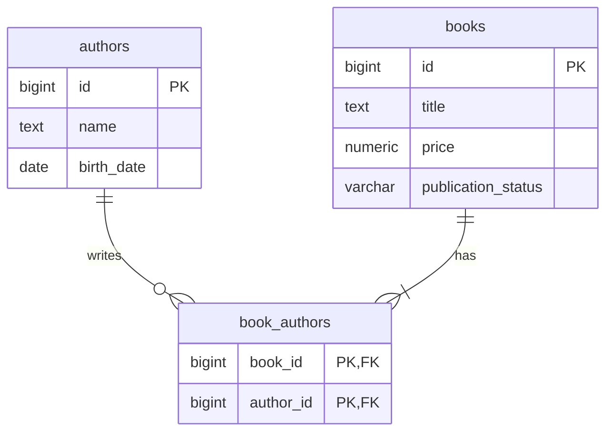

# 書籍管理API

[](https://github.com/k2kswr/BookManagementApp/actions/workflows/ci.yml)

Kotlin / Spring Boot / jOOQ / PostgreSQL による書籍管理のバックエンドAPIです。
書籍・著者の登録と更新、著者に紐づく書籍の取得に対応します。

## 必要な環境

- JDK 21（`java -version` と `JAVA_HOME` を確認してください）
- Docker Engine / Docker Desktop と Docker Compose v2（起動済みであること）
- 初回のGradle・依存ライブラリ・コンテナイメージ取得用のインターネット接続

GradleはWrapperを同梱しています。グローバルインストールは不要です。
Windowsでは以下の `./gradlew` を `.\gradlew.bat` に置き換えて実行できます。

## クイックスタート

APIは `http://localhost:8080` で起動します。最初にDockerでPostgreSQLを起動し、別のターミナルでSpring Bootを起動します。Spring Bootを起動したターミナルはそのまま開いておき、API操作は別のターミナルで行います。

| 操作 | Windows PowerShell | macOS / Linux |
| --- | --- | --- |
| PostgreSQLを起動 | `docker compose up -d --wait` | `docker compose up -d --wait` |
| APIを起動 | `.\gradlew.bat bootRun` | `./gradlew bootRun` |
| 全テスト | `.\gradlew.bat clean build` | `./gradlew clean build` |
| PostgreSQLに接続 | `docker compose exec db psql -U books -d books` | `docker compose exec db psql -U books -d books` |
| レコードを全削除 | `docker compose exec db psql -U books -d books -c "TRUNCATE book_authors, books, authors RESTART IDENTITY CASCADE;"` | 同左 |
| DBを停止（レコードは保持） | `docker compose stop` | `docker compose stop` |
| DBを作り直す（レコードを全削除） | `docker compose down -v` | `docker compose down -v` |

`docker compose down -v` はDBのレコードを削除します。次回起動後に、Flywayがテーブルを作成します。

起動時、ビルドは次の順で処理されます。

1. `flywayMigrate`：開発用PostgreSQLにマイグレーション適用。
2. `jooqCodegen`：適用済みの3テーブルからJavaコードを `build/generated/jooq` に生成。
3. `compileKotlin` / `compileJava`：アプリケーションをコンパイル。

生成されたJavaコードはjOOQのDBアクセス用です。アプリケーションとテストはKotlinで実装しています。
Flywayの履歴テーブルは生成対象外です。生成コードはGit管理せず、SQLから再生成します。
IDEへの初回インポート時は、先に `./gradlew jooqCodegen` を実行してください。

作成された実行可能JARは、次のように起動できます。

```sh
java -jar build/libs/book-management-api-0.0.1-SNAPSHOT.jar
```

JAR実行時にもFlywayが未適用マイグレーションを確認します。
開発用DBの既定値は以下です。Composeの認証情報はローカル開発専用です。

| 環境変数 | 既定値 |
| --- | --- |
| `DB_URL` | `jdbc:postgresql://localhost:5432/books` |
| `DB_USER` | `books` |
| `DB_PASSWORD` | `books` |

Gradleとアプリケーションの両方が同じ変数を参照します。
ビルド時にマイグレーションを適用するため、接続先には開発・CI専用DBを指定してください。
ComposeはDBポートを `127.0.0.1` のみに公開します。
ポート競合時は `compose.yaml` のホスト側ポートと `DB_URL` を合わせて変更してください。

## API

全リクエスト・レスポンスはJSONです。PUTは全項目の置換で、部分更新ではありません。

| メソッド | パス | 処理 | 成功ステータス |
| --- | --- | --- | --- |
| POST | `/authors` | 著者登録 | 201 |
| PUT | `/authors/{authorId}` | 著者更新 | 200 |
| POST | `/books` | 書籍登録 | 201 |
| PUT | `/books/{bookId}` | 書籍更新・著者の差し替え | 200 |
| GET | `/authors/{authorId}/books` | 対象著者が執筆した書籍一覧 | 200 |

### 動作確認コマンド

以下は空のDBから実行する例です。登録後に返るIDを変数で保持するため、IDを手入力する必要がありません。

#### Windows PowerShell

Windowsでは `Invoke-RestMethod` を使います。表示の文字化けが起きる場合は、先に次を一度だけ実行してください。

```powershell
chcp 65001
[Console]::InputEncoding = [System.Text.UTF8Encoding]::new()
[Console]::OutputEncoding = [System.Text.UTF8Encoding]::new()
$OutputEncoding = [Console]::OutputEncoding
```

著者を登録します。

```powershell
$author = Invoke-RestMethod -Uri 'http://localhost:8080/authors' -Method Post -ContentType 'application/json; charset=utf-8' -Body (@{
  name = 'Author A'
  birthDate = '1990-01-01'
} | ConvertTo-Json -Compress)

$author
```

書籍を登録し、対象著者の書籍一覧を取得します。

```powershell
$book = Invoke-RestMethod -Uri 'http://localhost:8080/books' -Method Post -ContentType 'application/json; charset=utf-8' -Body (@{
  title = 'Kotlin Intro'
  price = 1200.00
  authorIds = @($author.id)
  publicationStatus = 'UNPUBLISHED'
} | ConvertTo-Json -Compress)

Invoke-RestMethod -Uri "http://localhost:8080/authors/$($author.id)/books"
```

著者と書籍を更新します。PUTは部分更新ではないため、全項目を送信します。

```powershell
$updatedAuthor = Invoke-RestMethod -Uri "http://localhost:8080/authors/$($author.id)" -Method Put -ContentType 'application/json; charset=utf-8' -Body (@{
  name = 'Author A Updated'
  birthDate = '1990-01-01'
} | ConvertTo-Json -Compress)

$updatedBook = Invoke-RestMethod -Uri "http://localhost:8080/books/$($book.id)" -Method Put -ContentType 'application/json; charset=utf-8' -Body (@{
  title = 'Kotlin Intro Revised'
  price = 1500.00
  authorIds = @($author.id)
  publicationStatus = 'PUBLISHED'
} | ConvertTo-Json -Compress)
```

#### macOS / Linux

macOS / Linuxの標準ターミナルでは `curl` を使います。著者登録後、レスポンスの`id`を控え、`AUTHOR_ID`と`BOOK_ID`を置き換えてください。

```sh
curl -i -X POST 'http://localhost:8080/authors' \
  -H 'Content-Type: application/json; charset=utf-8' \
  -d '{"name":"Author A","birthDate":"1990-01-01"}'

AUTHOR_ID=1

curl -i -X POST 'http://localhost:8080/books' \
  -H 'Content-Type: application/json; charset=utf-8' \
  -d "{\"title\":\"Kotlin Intro\",\"price\":1200.00,\"authorIds\":[$AUTHOR_ID],\"publicationStatus\":\"UNPUBLISHED\"}"

BOOK_ID=1

curl -i "http://localhost:8080/authors/$AUTHOR_ID/books"
```

更新例です。

```sh
curl -i -X PUT "http://localhost:8080/authors/$AUTHOR_ID" \
  -H 'Content-Type: application/json; charset=utf-8' \
  -d '{"name":"Author A Updated","birthDate":"1990-01-01"}'

curl -i -X PUT "http://localhost:8080/books/$BOOK_ID" \
  -H 'Content-Type: application/json; charset=utf-8' \
  -d "{\"title\":\"Kotlin Intro Revised\",\"price\":1500.00,\"authorIds\":[$AUTHOR_ID],\"publicationStatus\":\"PUBLISHED\"}"
```

#### 日本語データを登録する場合

Windows PowerShellの端末設定に左右されないよう、日本語の例はUTF-8 JSONファイルとして用意しています。空のDBでは、次の順に実行してください。

```powershell
curl.exe -i -X POST 'http://localhost:8080/authors' -H 'Content-Type: application/json; charset=utf-8' --data-binary '@examples/author-ja.json'
curl.exe -i -X POST 'http://localhost:8080/books' -H 'Content-Type: application/json; charset=utf-8' --data-binary '@examples/book-ja.json'
```

macOS / Linuxでは `curl.exe` を `curl` に置き換えます。`examples/book-ja.json` は著者IDが1であることを前提にしています。

#### PostgreSQLを直接確認する

```sql
-- psqlに接続後、テーブルとデータを確認する
\dt
SELECT * FROM authors;
SELECT * FROM books;
SELECT * FROM book_authors;

-- psqlを終了する
\q
```

書籍一覧のレスポンスは、書籍ID昇順・著者ID昇順です。対象著者以外の共著者も含めます。著者が存在し、書籍がない場合は `[]` です。

### 検証ルール・前提

- 全入力項目が必須。欠落・null・未知のプロパティ・不正なJSONは400。
- タイトルと著者名は空文字・空白のみを不可。名前・タイトルの重複は許可。
- 価格は `BigDecimal` / `NUMERIC(12,2)`。0〜9999999999.99、小数2桁まで。丸めは行わない。
- 通貨は仕様未指定のため、通貨換算や円単位の整数制約を設けない。
- 著者を事前登録し、書籍には存在する著者IDを最低1件指定する。ID重複・null要素は不可。
- 生年月日は `YYYY-MM-DD`。`Asia/Tokyo` の現在日以前（当日を含む）。
- 出版状況は `UNPUBLISHED` / `PUBLISHED`。出版済みから未出版への変更は409。
- 出版済みの書籍もタイトル・価格・著者は更新可能。出版済みでの新規登録も可能。
- IDはDB採番の64bit整数。クライアントからは指定しない。
- 同時PUTは書籍行のロックで直列化する。許可される更新同士は後から実行された内容が残る。
- 認証・削除・検索・ページング・フロントエンド・外部ホスティングは対象外。

### エラー

`application/problem+json` の `ProblemDetail` に、機械判別用の `code` を追加します。
Bean Validationのエラーでは `errors` にフィールド名とメッセージが入ります。

| HTTP | code | 例 |
| --- | --- | --- |
| 400 | `INVALID_INPUT` | 入力違反、不正な日付・enum、未登録の関連著者ID |
| 404 | `NOT_FOUND` | 更新対象の書籍・著者、一覧取得対象の著者が存在しない |
| 409 | `INVALID_STATUS_TRANSITION` | 出版済みから未出版に戻そうとした |
| 500 | `INTERNAL_ERROR` | 想定外のサーバー障害（詳細はサーバーログのみ） |

```json
{
  "type": "about:blank",
  "title": "Conflict",
  "status": 409,
  "detail": "Published books cannot become unpublished",
  "instance": "/books/1",
  "code": "INVALID_STATUS_TRANSITION"
}
```

## 設計と採用理由



- **Controller → Service → Repository**：HTTP・業務ルール・SQLを分離。書籍と著者のパッケージにまとめ、小規模な課題に不要な多層化や汎用基底クラスを避けています。
- **jOOQ**：生成されたテーブル・カラムでSQLを記述。生成Recordを外部公開せずDTOに変換します。
- **Flyway**：SQLをスキーマの正本とし、コード生成・起動・結合テストで同じマイグレーションを利用します。
- **多対多**：中間テーブルの複合主キーと外部キーで重複と不正参照を防止。著者起点の取得用に索引を用意します。
- **トランザクション**：書籍保存と著者関連の全置換を一括処理。関連保存の失敗時には書籍の変更も戻します。
- **状態遷移**：`SELECT ... FOR UPDATE` で現在の書籍行をロックした後に検証。競合時も出版済みを未出版に戻せません。
- **境界の明示**：最低1著者・生年月日・状態遷移はAPI経由で保証します。DBに直接書き込む運用は対象外です。DBには非負価格・必須・出版状況の値・外部キーなど静的な制約を設けています。
- **N+1回避**：一覧は著者の存在確認・対象書籍ID取得・共著者を含む一括取得で最大3クエリ。書籍数に比例してSQLを発行しません。
- **Kotlin**：`val`、非Null型、コンストラクタインジェクションを使用。Jacksonの厳密なNull検証でコレクション内部のnullも拒否します。
- **Clock注入**：現在日を固定できるため、日付境界のテストが実行日に依存しません。

## テスト

開発DBを起動した状態で実行してください。単体テスト自体はDBを使いませんが、クリーンビルド時のjOOQ生成にはDBが必要です。

```sh
./gradlew test             # 業務ルール・Bean Validationの単体テスト
./gradlew integrationTest  # Testcontainersで独立したPostgreSQL 17を起動
./gradlew ktlintCheck      # 整形確認
./gradlew ktlintFormat     # 整形適用
./gradlew clean build      # 上記の検証とJAR作成
```

標準の結合テストはDockerが利用できない場合にスキップせず失敗します。
開発DBのデータは結合テストの初期化対象ではありません。通常はTestcontainersが用意したDBだけを初期化します。

Dockerを利用できない環境では、別途用意した**破棄可能なテスト専用PostgreSQL 17のDB**を
`TEST_DB_URL` で明示すると、同じ結合テストをそのDBで実行できます。
このモードでは各テスト前に3テーブルをTRUNCATEするため、開発用・実データのあるDBを指定しないでください。
`TEST_DB_USER` / `TEST_DB_PASSWORD` の既定値は `books` です。
GitHub Actionsではこれらを指定せず、標準のTestcontainers経路を使用します。

```powershell
$env:DB_URL = 'jdbc:postgresql://localhost:55432/books'
$env:TEST_DB_URL = 'jdbc:postgresql://localhost:55432/books_test'
.\gradlew.bat clean build
```

| 検証 | ケース |
| --- | --- |
| 単体 | 出版状況の4遷移、東京日付の昨日・当日・翌日、価格の境界値 |
| HTTP | 登録・更新・一覧、欠落・null・不正日付・不正enum・空白・重複著者、400/404/409 |
| DB | 共著、著者の差し替え、共著者を含む一覧、順序、書籍なし |
| 原子性 | テスト専用トリガーで関連保存を失敗させ、書籍作成・書籍更新・関連削除がロールバックされること |
| 同時更新 | 2トランザクションを使い、PostgreSQLの実際のロック待ちを観測してから出版を確定し、未出版への更新拒否を確認 |
| エラー秘匿 | DBエラーのSQLや内部メッセージがHTTPレスポンスに出ないこと |

レポートは `build/reports/tests/test/index.html` と `build/reports/tests/integrationTest/index.html` です。
GitHub ActionsはJava 21とコード生成用PostgreSQLを準備し、`clean build` とテストレポート保存を行います。

## 技術バージョン

Spring Boot 3.5.16、Kotlin 2.1.21、Gradle 8.14.3、jOOQ 3.19.35、Flyway 11.7.2、PostgreSQL 17.6。
jOOQはSpring Boot管理の実行用バージョンと公式コード生成プラグインを一致させています。
KotlinはGradleプラグインと実行用ライブラリを2.1.21に揃えています。

参考： [Spring Boot依存管理](https://docs.spring.io/spring-boot/3.5/appendix/dependency-versions/coordinates.html)、
[jOOQ公式Gradleプラグイン](https://www.jooq.org/doc/3.19/manual/code-generation/codegen-execution/codegen-gradle/)、
[jOOQコード生成設定](https://www.jooq.org/doc/3.19/manual/code-generation/codegen-configuration/)。

## 提出前の確認

1. 新しくcloneしたディレクトリで、READMEの起動と `clean build` が成功すること。
2. GitHub Actionsの実行結果が成功していること。
3. `.env`、認証情報、`.tools`、ビルド生成物がGitに含まれていないこと。
4. リポジトリをpublicにし、提出先にリポジトリURLを送ること。

課題文の転載や実際の個人情報は登録せず、サンプルデータで動作確認できます。
