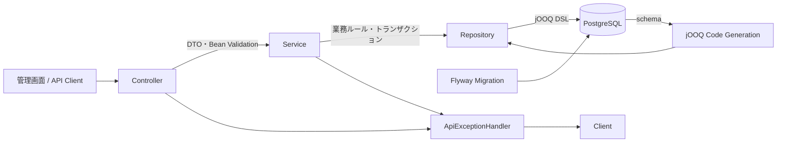

# アーキテクチャ

HTTP、業務ルール、SQLを分離するため、Controller → Service → Repositoryの3層構成を採用しています。DTOはAPIの入出力専用で、jOOQの生成RecordをHTTPレスポンスに直接返しません。

## レイヤーごとの責務

| レイヤー | 主なクラス | 責務 |
| --- | --- | --- |
| Controller | `AuthorController`, `BookController` | HTTPパス・ステータス、JSONの入出力、`@Valid`による入力検証 |
| Service | `AuthorService`, `BookService` | 生年月日、著者の存在、出版状況遷移、トランザクション境界 |
| Repository | `AuthorRepository`, `BookRepository` | jOOQを使ったINSERT・UPDATE・SELECT、RecordからDTOへの変換 |
| Common | `ApiException`, `ApiExceptionHandler` | 業務エラーと`ProblemDetail`形式のHTTPエラー応答 |
| Static UI | `resources/static/` | Spring Bootから配信するHTML・CSS・JavaScript。既存APIを`fetch`で呼び出して管理画面を表示 |

## 管理画面

`GET /`では`resources/static/index.html`を配信します。画面は外部ライブラリを使用せず、同じSpring Bootプロセスから配信される`app.js`が既存APIを呼び出します。

画面表示のために`GET /authors`と`GET /books`を追加しました。書籍フォームの著者選択肢、一覧、件数表示に使い、著者を選択した際の書籍表示は既存の`GET /authors/{authorId}/books`を利用します。

## 書籍登録・更新の流れ

1. ControllerがJSONを`BookRequest`へ変換し、必須項目・価格・著者ID件数を検証する。
2. Serviceが著者IDの重複と、全著者の存在を確認する。
3. Repositoryが書籍を保存し、中間テーブル`book_authors`を更新する。
4. 作成・更新後の書籍と著者を一括取得して`BookResponse`として返す。

書籍の更新は`@Transactional`で実行します。著者との関連を置き換える途中で失敗した場合、書籍本体の更新・中間テーブルの削除・再登録はすべてロールバックされます。

## 出版状況の整合性

書籍更新時は、対象行を`SELECT ... FOR UPDATE`でロックしてから状態を確認します。これにより、同時更新があっても出版済みの書籍を未出版へ戻せません。

| 変更前 | 変更後 | 結果 |
| --- | --- | --- |
| `UNPUBLISHED` | `UNPUBLISHED` | 許可 |
| `UNPUBLISHED` | `PUBLISHED` | 許可 |
| `PUBLISHED` | `PUBLISHED` | 許可 |
| `PUBLISHED` | `UNPUBLISHED` | 409 Conflict |

## エラー応答

`ApiExceptionHandler`が例外を`application/problem+json`へ変換し、`code`を付与します。内部例外やSQLの詳細は500レスポンスに含めません。

| ステータス | code | 代表例 |
| --- | --- | --- |
| 400 | `INVALID_INPUT` | 入力形式、価格、生年月日、重複著者ID、未登録著者ID |
| 404 | `NOT_FOUND` | 更新対象の書籍・著者、取得対象の著者が存在しない |
| 409 | `INVALID_STATUS_TRANSITION` | 出版済みから未出版へ変更しようとした |
| 500 | `INTERNAL_ERROR` | 想定外のサーバー障害 |
