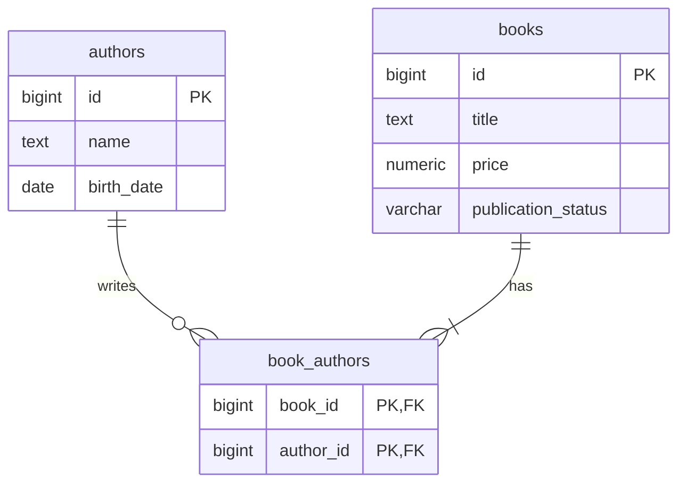

# データベース

PostgreSQL 17を使用します。スキーマの正本は[`V1__create_books_and_authors.sql`](../src/main/resources/db/migration/V1__create_books_and_authors.sql)です。FlywayがこのSQLを適用し、その結果からjOOQが型安全なテーブル・カラム定義を生成します。



## テーブル

### `authors`

| カラム | 型 | 制約 | 説明 |
| --- | --- | --- | --- |
| `id` | `BIGINT` | 主キー、ID採番 | 著者ID |
| `name` | `TEXT` | NOT NULL、空白のみ不可 | 著者名 |
| `birth_date` | `DATE` | NOT NULL | 生年月日 |

### `books`

| カラム | 型 | 制約 | 説明 |
| --- | --- | --- | --- |
| `id` | `BIGINT` | 主キー、ID採番 | 書籍ID |
| `title` | `TEXT` | NOT NULL、空白のみ不可 | 書籍タイトル |
| `price` | `NUMERIC(12,2)` | NOT NULL、0以上 | 価格。整数10桁・小数2桁まで |
| `publication_status` | `VARCHAR(11)` | NOT NULL、CHECK | `UNPUBLISHED`または`PUBLISHED` |

### `book_authors`

| カラム | 型 | 制約 | 説明 |
| --- | --- | --- | --- |
| `book_id` | `BIGINT` | 主キー、`books.id`への外部キー | 書籍 |
| `author_id` | `BIGINT` | 主キー、`authors.id`への外部キー | 著者 |

`(book_id, author_id)`の複合主キーにより、同じ著者を同じ書籍へ重複して関連付けられません。`(author_id, book_id)`の索引は、著者に紐づく書籍を取得するクエリを支えます。

## 制約を置く場所

| ルール | 実装場所 | 理由 |
| --- | --- | --- |
| 空白のみの名前・タイトル不可 | DB CHECK・Bean Validation | API以外からの書き込みにも備える |
| 価格が0以上 | DB CHECK・Bean Validation | 永続化前に分かりやすく400を返し、DBでも守る |
| 出版状況が2値 | DB CHECK・Kotlin enum | DBとAPIの両方で不正値を防ぐ |
| 著者が最低1人 | Service・Bean Validation | 中間テーブルだけでは最低件数を表せない |
| 出版済みから未出版への変更不可 | Service・行ロック | 現在値との比較と同時更新の制御が必要 |
| 生年月日が未来ではない | Service・`Clock` | 現在日を使う業務ルールのため |

## FlywayとjOOQの流れ

```text
src/main/resources/db/migration/*.sql
        │
        ▼
flywayMigrate
        │
        ▼
PostgreSQL schema
        │
        ▼
jooqCodegen
        │
        ▼
build/generated/jooq/
```

`build.gradle.kts`では`jooqCodegen`が`flywayMigrate`に依存するよう設定しています。生成コードは`build/`配下に出力され、Git管理しません。
